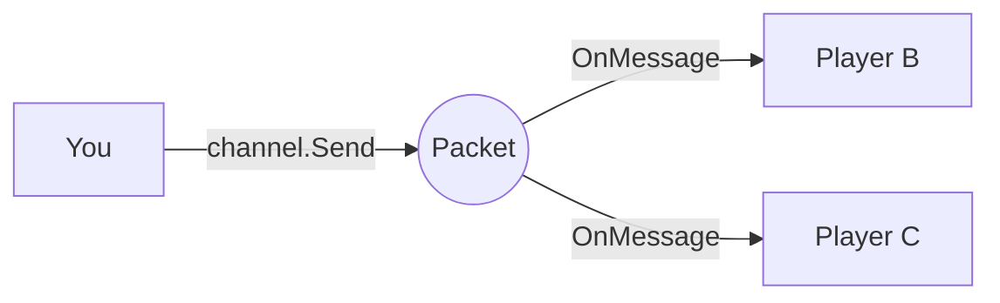

# Packet
A networking library for Gorilla Tag mods for sending messages over WebSockets without the risks of Photon RPCs or custom properties (this uses my backend which is closed source, free to use though)

> [!NOTE]
> Packet runs on its own separately from Photon meaning your mod traffic is invisible to the game and it doesn't interfere with any of the game's networking



## Usage
Register your mod once on startup and get a typed channel back like so:

```csharp
using Packet.Api;

var reg = PacketApi.RegisterMod(this);
var channel = reg.GetChannel<Ping>("ping");
```

You can subscribe to incoming messages and send your own and only other players with your mod installed will receive them:

```csharp
channel.OnMessage += (player, msg) =>
{
    if (msg.Active)
        Debug.Log($"pong from {player?.NickName}");
};

channel.Send(new Ping { Active = true });
```

Your payload can be any serializable class

```csharp
public class Ping
{
    public bool Active { get; set; }
}
```

> [!IMPORTANT]
> Sending too fast will get you ratelimited so try and space out high frequency updates or batch them into one message

## Presence
Track which players in the room also have your mod

```csharp
var presence = reg.GetPresence();

presence.OnPlayerJoined += player => Debug.Log($"{player.NickName} has the mod");
presence.OnPlayerLeft  += player => Debug.Log($"{player.NickName} left");
```

`Players` gives you the current list at any time

```csharp
Debug.Log($"{presence.Players.Count} players have the mod");
```

Presence is automatically cleaned up when you call `reg.Unregister()`

## Releasing channels
If you no longer need a channel you can release it

```csharp
reg.ReleaseChannel("ping");
```

Or remove everything for your mod at once

```csharp
reg.Unregister();
```

## Connection state
You can watch the connection state if you need to know when the client connects or drops

```csharp
PacketApi.OnStateChanged += state =>
{
    Debug.Log($"Packet: {state}");
};
```

States are `Disconnected`, `Connecting`, `Connected`, and `Reconnecting` + The client will try to reconnect on its own if it drops, waiting a bit longer between each attempt

> [!TIP]
> Use `PacketApi.Connected` to check if you're connected before doing something that depends on it and sends while disconnected are queued and will go out when the connection comes back

## Error handling
Listen for errors if you want to show something to the player when the connection fails

```csharp
PacketApi.OnError += error =>
{
    if (error == PacketError.ConnectionLost)
        Debug.Log("Lost connection to Packet");
    if (error == PacketError.RoomFull)
        Debug.Log("Room is full");
};
```

`OnError` is on the unity main thread and only fires when the error is permanent and temporary drops that recover on their own won't trigger it

## Additional Info
- Messages will obviously only reach players in the same room
- Payloads are capped at 4KB

<details>
<summary>API Reference</summary>

### PacketApi

| Member | Description |
|---|---|
| `RegisterMod(BaseUnityPlugin plugin)` | Registers your mod and returns a `ModRegistration` |
| `Connected` | `true` if currently connected to the server |
| `OnStateChanged` | Fires on every connection state change, `Action<ConnectionState>` |
| `OnError` | Fires when the connection fails permanently, `Action<PacketError>` |

### ModRegistration

| Method | Description |
|---|---|
| `GetChannel<T>(string name)` | Returns a typed channel, creating it if it doesn't exist |
| `GetPresence()` | Returns the presence tracker for this mod |
| `ReleaseChannel(string name)` | Removes a single channel |
| `Unregister()` | Removes all channels and presence for this mod |

### Presence

| Member | Description |
|---|---|
| `Players` | `IReadOnlyList<Player>` of players currently in the room with the mod |
| `OnPlayerJoined` | Fires when a player with the mod joins, `Action<Player>` |
| `OnPlayerLeft` | Fires when a player leaves or times out, `Action<Player>` |

### Channel\<T\>

| Member | Description |
|---|---|
| `Send(T payload)` | Sends to everyone else in the room. Returns `true` if sent now, `false` if queued |
| `SendTo(Player player, T payload)` | Sends to one player only. Returns `true` if sent now, `false` if queued |
| `SendTo(int actorNumber, T payload)` | Same but takes a Photon actor number. Returns `false` if the actor isn't in the room |
| `SendTo(string userId, T payload)` | Same but takes a user ID string instead of a player |
| `OnMessage` | Fires when a message arrives, `Action<Player?, T>` first arg is the sender. Can be `null` if they left before the message was processed. When you join a room you'll get the last broadcast on each channel automatically |

### ConnectionState

| Value | Description |
|---|---|
| `Disconnected` | Not connected |
| `Connecting` | Connecting to the server |
| `Connected` | Ready |
| `Reconnecting` | Dropped, trying again |

### PacketError

| Value | Description |
|---|---|
| `HandshakeFailed` | Could not connect to the Packet server |
| `RoomFull` | Room has reached the player limit |
| `AuthFailed` | Server rejected the session |
| `Throttled` | Sending too fast |
| `PayloadTooLarge` | Payload was over 4KB |
| `InvalidFrame` | Malformed message |
| `ConnectionLost` | Unexpected disconnect |

</details>